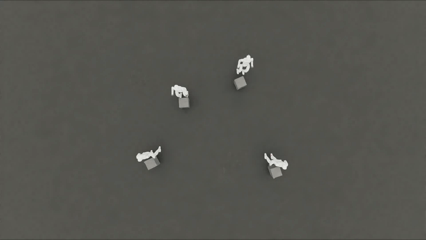

<div align="center">

# Carry2Anywhere

### Generalizable Humanoid Box-Carrying via Teacher–Student Distillation

<sub>**🌐 [English](#english) · [中文](#中文)**</sub>

<a href="docs/result.mp4"></a>

<sub>↑ Click the GIF for the full <a href="docs/result.mp4">MP4 demo</a>.</sub>

</div>

---

<a id="english"></a>

## About

**Carry2Anywhere** trains a humanoid robot (Unitree G1, 29-DoF) to **pick up a box and carry it to an arbitrary target location** in simulation. The pipeline has two stages:

1. **Teacher (PPO + WBT).** A whole-body-tracking PPO policy that imitates reference object-interaction motions (e.g., OMOMO `largebox` clips) is trained with privileged observations.
2. **Student (BC distillation).** A history-conditioned student is then distilled from the teacher under a **deployable** observation set no motion-reference inputs, just proprioception, object pose and target position with a 50-step history window.

The result is a single policy that generalizes across motion clips and box target positions without needing reference trajectories at inference time.

This repository contains everything you need to (a) reproduce the teacher, (b) distill a student, and (c) play the released checkpoints.

## What's released

- ✅ Full training & distillation pipeline (PPO + DAgger)
- ✅ Pre-trained checkpoints, hosted on [🤗 yeager1225/Carry2Anywhere](https://huggingface.co/yeager1225/Carry2Anywhere)
  - `Teacher/model_177999.pt` — PPO teacher
  - `Student/model_20000.pt`, `model_14000.pt` — distilled students
- ✅ 46 retargeted G1 + box motion clips under `src/holosoma/holosoma/motions/`
- ✅ Two automated env-setup scripts for Isaac Sim 5.1 + Isaac Lab v2.3.0

### Download the pre-trained checkpoints

```bash
bash scripts/download_checkpoints.sh
```

The script uses `huggingface-cli` if available, otherwise falls back to plain
`curl`. Files land under `checkpoints/{Teacher,Student}/`.

## Getting Started

### Dependencies

The full setup is documented in [SETUP.md](SETUP.md). Two conda envs are
created:

| Env name        | Purpose                                                |
| --------------- | ------------------------------------------------------ |
| `hsretargeting` | Human-motion retargeting + data preparation (optional) |
| `hssim`         | Training, distillation and evaluation in Isaac Sim     |

For training/distillation only you need `hssim`:

```bash
git clone https://github.com/<your-org>/Carry2Anywhere.git
cd Carry2Anywhere

# Installs miniconda (if missing), creates the `hssim` conda env,
# fetches Isaac Sim 5.1 + Isaac Lab v2.3.0, installs holosoma editable.
bash scripts/setup_isaacsim.sh
```

> First-time install downloads ~7–10 GB and takes 30–60 minutes. See
> [SETUP.md §5](SETUP.md#5-install-the-training-env-hssim-isaac-sim-51--isaac-lab-v230)
> for the full breakdown and known workarounds.

Activate the env in every new shell:

```bash
source scripts/source_isaacsim_setup.sh   # = `conda activate hssim` + EULA env var
```

### Hardware

Verified on a single RTX 3090 (24 GB) under Ubuntu 22.04 with NVIDIA driver
580.142. Smaller GPUs work — drop `--training.num_envs` accordingly.

## Run Carry2Anywhere

All commands assume `hssim` is active and you are at the repo root.

### 1. Train the teacher

```bash
python src/holosoma/holosoma/train_agent.py exp:g1-29dof-wbt-w-object \
  --command.setup_terms.motion_command.params.motion_config.motion_dir=src/holosoma/holosoma/motions \
  --command.setup_terms.motion_command.params.motion_config.motion_glob="*_w_obj.npz" \
  --training.num_envs=4096 \
  --training.headless=True
```

- `exp:g1-29dof-wbt-w-object` selects the G1 + box whole-body-tracking
  experiment defined in
  [`config_values/wbt/g1/experiment.py`](src/holosoma/holosoma/config_values/wbt/g1/experiment.py).
- Resume from a checkpoint with `--training.checkpoint <path>.pt`.
- Logs and checkpoints land in `logs/WholeBodyTracking/<timestamp>-...`.

### 2. Distill the student (DAgger, no motion-reference inputs)

```bash
PYTORCH_CUDA_ALLOC_CONF=expandable_segments:True \
python src/holosoma/holosoma/train_agent.py \
  exp:g1-29dof-wbt-w-object \
  observation:g1-29dof-wbt-observation-distill-no-motion-h50 \
  --algo.config.distill.enabled=True \
  --algo.config.distill.teacher_checkpoint=checkpoints/Teacher/model_177999.pt \
  --algo.config.distill.dagger_only=True \
  --algo.config.distill.dagger_anneal=False \
  --algo.config.distill.dagger_coefficient_max=1.0 \
  --algo.config.num_learning_iterations=80000 \
  --algo.config.actor_learning_rate=1e-4 \
  --algo.config.critic_learning_rate=1e-4 \
  --algo.config.min_actor_learning_rate=1e-4 \
  --algo.config.min_critic_learning_rate=1e-4 \
  --algo.config.init_noise_std=0.3 \
  --algo.config.entropy_coef=0.005 \
  --command.setup_terms.motion_command.params.motion_config.motion_dir=src/holosoma/holosoma/motions \
  --command.setup_terms.motion_command.params.motion_config.motion_glob="*_w_obj.npz" \
  --training.num_envs=3000 \
  --training.headless=True
```

Notes on the distillation flags:

- `observation:g1-29dof-wbt-observation-distill-no-motion-h50` swaps the actor
  inputs for a deployable proprio + box pose stack with a 50-step history
  window, while keeping the teacher's privileged observations as imitation
  targets. See
  [`config_values/wbt/g1/observation.py`](src/holosoma/holosoma/config_values/wbt/g1/observation.py).
- `dagger_only=True` + `dagger_coefficient_max=1.0` keeps the loss in pure
  behaviour-cloning mode. Disabling the PPO anneal (`dagger_anneal=False`) is
  essential — letting the PPO loss fade in tends to drag the student off the
  teacher's distribution.
- `init_noise_std=0.3` and the `min_*_learning_rate=1e-4` floors are required
  in pure-BC mode: the actor's `noise_std` and the adaptive LR scheduler are
  both downstream of the PPO update, which we have masked out here.

### 3. Visualize a checkpoint (teacher or student)

Single env, GUI window with a tracking camera:

```bash
python src/holosoma/holosoma/eval_agent.py \
  --checkpoint checkpoints/Student/model_20000.pt \
  --algo.config.distill.enabled=False \
  --command.setup_terms.motion_command.params.motion_config.motion_dir=src/holosoma/holosoma/motions \
  --command.setup_terms.motion_command.params.motion_config.motion_glob="*_w_obj.npz" \
  --command.setup_terms.motion_command.params.motion_config.eval_motion_id=-1 \
  --training.num_envs=1 \
  --training.headless=False \
  --simulator.config.viewer.enable_tracking=True \
  simulator.config.viewer.camera:spherical-camera-config \
  --simulator.config.viewer.camera.distance=4.0 \
  --simulator.config.viewer.camera.elevation=20.0 \
  --simulator.config.viewer.camera.azimuth=135.0
```

Headless evaluation (4 parallel envs, no rendering):

```bash
python src/holosoma/holosoma/eval_agent.py \
  --checkpoint checkpoints/Teacher/model_177999.pt \
  --command.setup_terms.motion_command.params.motion_config.motion_dir=src/holosoma/holosoma/motions \
  --command.setup_terms.motion_command.params.motion_config.motion_glob="*_w_obj.npz" \
  --command.setup_terms.motion_command.params.motion_config.eval_motion_id=-1 \
  --training.headless=True --training.num_envs=4 \
  --simulator.config.scene.env_spacing=5.0
```

## 📁 Repository layout

```
Carry2Anywhere/
├── checkpoints/                # Released teacher / student weights
│   ├── Teacher/model_177999.pt
│   └── Student/model_{14000,20000}.pt
├── docs/                       # Demo media (used in this README)
├── scripts/                    # One-shot env install + activation scripts
├── src/
│   ├── holosoma/               # Training / eval / distillation (env: hssim)
│   └── holosoma_retargeting/   # Motion retargeting toolkit (env: hsretargeting)
├── README.md
└── SETUP.md
```

## Acknowledgements

This codebase builds on a number of excellent open-source projects:

- [**holosoma**](https://github.com/amazon-far/holosoma) — provides the excellent motion-retargeting code framework that this repo builds on.
- [**Isaac Sim**](https://developer.nvidia.com/isaac/sim) and [**Isaac Lab**](https://github.com/isaac-sim/IsaacLab) — physics simulation and managed RL environment infrastructure.
- [**OMOMO**](https://github.com/lijiaman/omomo_release) — reference human–object interaction motion clips used to drive teacher training.
- [**Unitree G1**](https://www.unitree.com/g1) — robot model.

Released under the [MIT License](LICENSE). Note that the code depends on external libraries and datasets (holosoma, Isaac Sim, OMOMO, etc.), each of which is governed by its own license and terms of use.

---

<a id="中文"></a>

## 项目简介

**Carry2Anywhere** 在仿真中训练人形机器人 (宇树 G1, 29 自由度)**抱起一个箱子并把它搬运到任意目标位置**。整套 pipeline 分两阶段：

1. **教师 (PPO + 全身跟踪)**：基于特权观测的全身跟踪 PPO，模仿参考的人–物交互动作 (例如 OMOMO 的 `largebox` clips)。
2. **学生 (BC 蒸馏)**：在**可部署的观测集**下从教师蒸馏出一个带历史窗口的学生策略——剔除 motion-reference 输入，只保留本体状态、箱子位姿和目标位置，并使用 50 步历史窗口。

最终得到的单一策略能够跨 motion clip、跨任意箱子目标位置泛化，推理时不再需要参考轨迹。

本仓库包含 (a) 复现教师、(b) 蒸馏学生、(c) 直接玩已发布 checkpoint 所需的全部代码与数据。

## 已开源内容

- ✅ 完整的训练与蒸馏流程 (PPO + DAgger)
- ✅ 预训练 checkpoint，托管在 [🤗 yeager1225/Carry2Anywhere](https://huggingface.co/yeager1225/Carry2Anywhere)
  - `Teacher/model_177999.pt`——PPO 教师
  - `Student/model_20000.pt`、`model_14000.pt`——蒸馏后的学生
- ✅ 46 条 G1 + 箱子的 retargeted motion clip，位于 `src/holosoma/holosoma/motions/`
- ✅ Isaac Sim 5.1 + Isaac Lab v2.3.0 的两套自动化环境安装脚本

### 下载预训练 checkpoint

```bash
bash scripts/download_checkpoints.sh
```

脚本优先用 `huggingface-cli`，没有就退回到 `curl`。下载完成后文件在
`checkpoints/{Teacher,Student}/` 下。

## 快速开始

### 依赖

完整安装文档见 [SETUP.md](SETUP.md)。脚本会创建两个 conda 环境：

| 环境名          | 用途                                       |
| --------------- | ------------------------------------------ |
| `hsretargeting` | 人体动作 retargeting 与数据预处理（可选） |
| `hssim`         | Isaac Sim 中的训练、蒸馏与评估             |

只想跑训练 / 蒸馏的话，只需要 `hssim`：

```bash
git clone https://github.com/<your-org>/Carry2Anywhere.git
cd Carry2Anywhere

# 自动安装 miniconda（缺失时）、创建 hssim 环境、
# 拉取 Isaac Sim 5.1 + Isaac Lab v2.3.0、editable 安装 holosoma。
bash scripts/setup_isaacsim.sh
```

> 首次安装下载约 7–10 GB，耗时 30–60 分钟。详细步骤与常见问题
> 见 [SETUP.md §5](SETUP.md#5-install-the-training-env-hssim-isaac-sim-51--isaac-lab-v230)。

每个新 shell 中激活环境：

```bash
source scripts/source_isaacsim_setup.sh   # 等价于 conda activate hssim + 设置 EULA 变量
```

### 硬件

在单卡 RTX 3090 (24 GB) + Ubuntu 22.04 + NVIDIA driver 580.142 上验证通过。
显存更小的 GPU 也能跑，按需调小 `--training.num_envs` 即可。

## 运行 Carry2Anywhere

下面的命令默认 `hssim` 已激活，且你处在仓库根目录。

### 1. 训练教师

```bash
python src/holosoma/holosoma/train_agent.py exp:g1-29dof-wbt-w-object \
  --command.setup_terms.motion_command.params.motion_config.motion_dir=src/holosoma/holosoma/motions \
  --command.setup_terms.motion_command.params.motion_config.motion_glob="*_w_obj.npz" \
  --training.num_envs=4096 \
  --training.headless=True
```

- `exp:g1-29dof-wbt-w-object` 对应
  [`config_values/wbt/g1/experiment.py`](src/holosoma/holosoma/config_values/wbt/g1/experiment.py)
  里 G1 + 箱子的全身跟踪实验。
- 续训用 `--training.checkpoint <path>.pt`。
- 日志和 checkpoint 输出到 `logs/WholeBodyTracking/<timestamp>-...`。

### 2. 蒸馏学生（DAgger，丢掉 motion-reference 输入）

```bash
PYTORCH_CUDA_ALLOC_CONF=expandable_segments:True \
python src/holosoma/holosoma/train_agent.py \
  exp:g1-29dof-wbt-w-object \
  observation:g1-29dof-wbt-observation-distill-no-motion-h50 \
  --algo.config.distill.enabled=True \
  --algo.config.distill.teacher_checkpoint=checkpoints/Teacher/model_177999.pt \
  --algo.config.distill.dagger_only=True \
  --algo.config.distill.dagger_anneal=False \
  --algo.config.distill.dagger_coefficient_max=1.0 \
  --algo.config.num_learning_iterations=80000 \
  --algo.config.actor_learning_rate=1e-4 \
  --algo.config.critic_learning_rate=1e-4 \
  --algo.config.min_actor_learning_rate=1e-4 \
  --algo.config.min_critic_learning_rate=1e-4 \
  --algo.config.init_noise_std=0.3 \
  --algo.config.entropy_coef=0.005 \
  --command.setup_terms.motion_command.params.motion_config.motion_dir=src/holosoma/holosoma/motions \
  --command.setup_terms.motion_command.params.motion_config.motion_glob="*_w_obj.npz" \
  --training.num_envs=3000 \
  --training.headless=True
```

蒸馏关键 flag 说明：

- `observation:g1-29dof-wbt-observation-distill-no-motion-h50` 把 actor 输入
  换成可部署的 proprio + 箱子位姿堆叠，外加 50 步历史窗口；同时保留教师的
  特权观测作为模仿目标。配置见
  [`config_values/wbt/g1/observation.py`](src/holosoma/holosoma/config_values/wbt/g1/observation.py)。
- `dagger_only=True` + `dagger_coefficient_max=1.0` 让损失保持纯
  behaviour-cloning。一定要同时关掉 `dagger_anneal=False`——让 PPO loss
  渐入会把学生从教师分布上扯走。
- `init_noise_std=0.3` 和 `min_*_learning_rate=1e-4` 在纯 BC 模式下是必须的：
  actor 的 `noise_std` 和自适应 LR 调度器都依赖 PPO 更新，而我们这里把
  PPO 屏蔽掉了。

### 3. 可视化 checkpoint（教师或学生）

单环境 + GUI + 跟随相机：

```bash
python src/holosoma/holosoma/eval_agent.py \
  --checkpoint checkpoints/Student/model_20000.pt \
  --algo.config.distill.enabled=False \
  --command.setup_terms.motion_command.params.motion_config.motion_dir=src/holosoma/holosoma/motions \
  --command.setup_terms.motion_command.params.motion_config.motion_glob="*_w_obj.npz" \
  --command.setup_terms.motion_command.params.motion_config.eval_motion_id=-1 \
  --training.num_envs=1 \
  --training.headless=False \
  --simulator.config.viewer.enable_tracking=True \
  simulator.config.viewer.camera:spherical-camera-config \
  --simulator.config.viewer.camera.distance=4.0 \
  --simulator.config.viewer.camera.elevation=20.0 \
  --simulator.config.viewer.camera.azimuth=135.0
```

Headless 评估（4 个并行环境，不渲染）：

```bash
python src/holosoma/holosoma/eval_agent.py \
  --checkpoint checkpoints/Teacher/model_177999.pt \
  --command.setup_terms.motion_command.params.motion_config.motion_dir=src/holosoma/holosoma/motions \
  --command.setup_terms.motion_command.params.motion_config.motion_glob="*_w_obj.npz" \
  --command.setup_terms.motion_command.params.motion_config.eval_motion_id=-1 \
  --training.headless=True --training.num_envs=4 \
  --simulator.config.scene.env_spacing=5.0
```

## 📁 仓库结构

```
Carry2Anywhere/
├── checkpoints/                # 已发布的教师 / 学生权重
│   ├── Teacher/model_177999.pt
│   └── Student/model_{14000,20000}.pt
├── docs/                       # 演示素材（本 README 引用）
├── scripts/                    # 一键安装与环境激活脚本
├── src/
│   ├── holosoma/               # 训练 / 评估 / 蒸馏（环境：hssim）
│   └── holosoma_retargeting/   # 动作 retargeting 工具（环境：hsretargeting）
├── README.md
└── SETUP.md
```

## 致谢

本仓库依赖以下优秀开源项目：

- [**holosoma**](https://github.com/amazon-far/holosoma)——提供了本仓库所基于的优秀动作重映射代码框架。
- [**Isaac Sim**](https://developer.nvidia.com/isaac/sim) 与 [**Isaac Lab**](https://github.com/isaac-sim/IsaacLab)——物理仿真和受管的 RL 环境基础设施。
- [**OMOMO**](https://github.com/lijiaman/omomo_release)——驱动教师训练的人体–物体交互参考动作。
- [**宇树 G1**](https://www.unitree.com/g1)——机器人模型。

代码以 [MIT License](LICENSE) 开源。注意所依赖的外部库与数据集（holosoma、Isaac Sim、OMOMO 等）各自有独立的许可证和使用条款。
